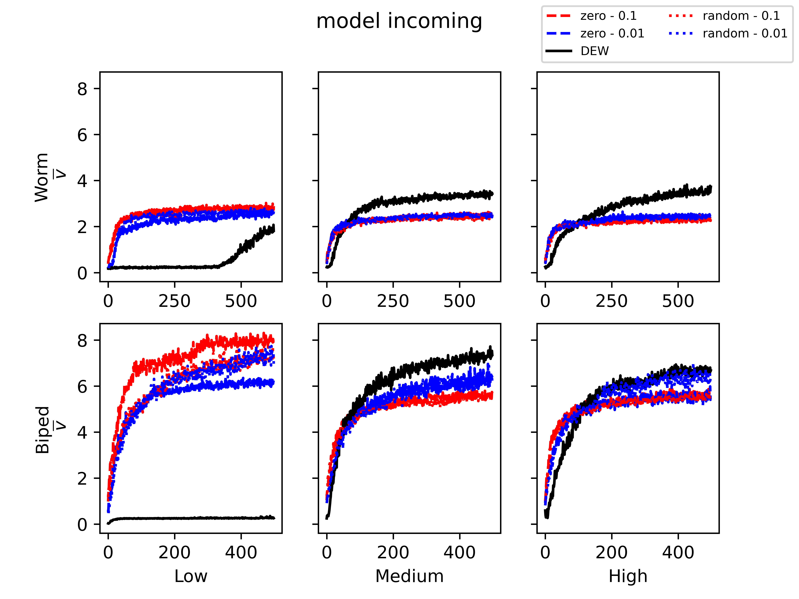
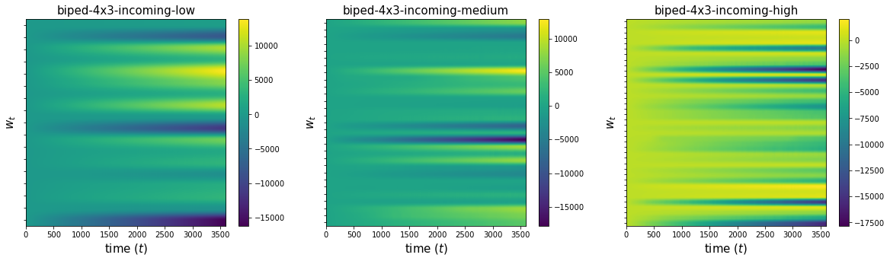

#**Hebbian Learning and Evolution**
In questi esperimenti siamo interessati a confrontare l'evoluzione diretta dei pesi e l'uso dell'Hebbian learning, in particolare usando l'$ABCD~rule$, dove i pesi vengono modificati usando 4 parametri, l'insieme di questi 4 parametri la chiamiamo $regola$. 

Comuni a tutti gli esperimenti che seguono sono le due morfologie del robot usate, un $worm~7\times1$ e un $biped~4\times3$, le tre configurazioni di sensori $high$, $medium$ o $low$. Il controllore è formato da un MLP con un hidden layer con la stessa dimensione dell'input. Per quanto riguarda l'Hebbian learning abbiamo usato due modelli: il $full$ e l'$incoming$ (ex output): nel primo, ogni peso ha la usa regola (per un totale di parametri da ottimizzare di $|\vec{p}| = 4|\vec{weights}|$), mentre nel secondo ogni neurone, tranne gli input, ha una regola che usa per modificare i pesi in uscita; il numero totale di parametri da ottimizzare in questo caso è $|\vec{p}| = 4(|\vec{neurons}| - |\vec{input})|$. 

---

##**1. Confronto evoluzione diretta pesi e Hebbian Learning**

Abbiamo analizzato il comportamento delle varie configurazioni rispetto al caso dove i pesi dell'MLP vengono ottimizzati direttamente (indicato con il termine DEW e di colore nero nei grafici). Per ciascuna morfologia, oltre alla configurazione con l'evoluzione diretta dei pesi, abbiamo testato i due modelli hebbiani usando due diversi metodi per l'inizializzazione dei pesi (a $zero$ o $random$) e due diversi valori di $\eta$ (0.1 e 0.01). Ricapitolando, i parametri testati sono:

*   Morfologie: $worm$, $biped$ 
*   Modelli: $incoming$, $full$, $diretto/mlp$
*   Configurazioni di sensori: $low$, $medium$, $high$
*   Inizializzazione dei pesi: $zero$, $random$
*   $\eta$: 0.01, 0.1

####**1.a Model comparison**
Vediamo qui il diverso andamento tra i due modelli, nel primo grafico con l'inizializzazione a 0 dei pesi, mentre nel secondo impostati randomicamente. 

Per entrambi i grafici si può concludere che:
1. Nella configurazione $low$ entrambi i modelli hebbiani hanno performance nettamente superiori.
2. Nelle configurazioni $medium$ e $high$ il modello $full$ ha performance comparabili o migliori del modello $DEW$, mentre modello $incoming$ ha performance comparabili o peggiori (nel caso del $biped$ sono strettamente migliori/peggiori). Questa differenza è più marcata con l'inizializzazione $zero$ dei pesi.
3. Non c'è invece una differenza significativa tra $\eta = 0.1$ e $\eta = 0.01$.

####**1.b Initialization comparison**

Allo stesso modo di prima vediamo ora le differenze tra le due inizializzazioni, mantendo fisso il modello al contrario del caso precedente. Abbiamo dunque, nella prima immagine il modello $incoming$, mentre nella seconda il modello $full$.

Dai grafici non sembra esserci una marcata e univoca differenza tra i due metodi di inizializzione.

####**1.c Adattabilità**
Infine abbiamo visto come si comportano i diversi modelli su terreni che non hanno affrontato durante l'evoluzione.
Nei grafici seguenti troviamo il boxplot delle velocità su dieci terreni di tipo Hilly. 
Come si vede i modelli hebbiani riescono ad adattarsi molto meglio ai nuovi terreni rispetto al caso base. 

### **Conclusioni**
Ricapitolando il modello $full$ ha prestazioni migliori del caso base, mentre il modello $incoming$ ha prestazioni uguali o peggiori, dipendentemente dalla morfologia usata. Entrambi i modelli però hanno una maggiroe fitness rispetto al caso base su terreni non visti durante l'evoluzione.
Non sembrano esserci rilevanti differenze invece sull'inizializzazione dei pesi o sul valore $\eta$ usato.  
Infine, per quanto riguarda l'andamento dei pesi durante la simulazioni mi allineo e concordo con quanto descritto nel punto 2.b

##**2. $\eta$ valore evoluto**

####**2.a Fitness**

Vogliamo verificare l'impatto che ha evolvere anche il parametro $\eta$. 
Di seguito, l'andamento della fitness, per due morfologie separatamente (prima colonna per $biped$, seconda colonna per $worm$), al variare del modello (prima riga per $full$, seconda riga per $incoming$, mentre $DEW$ non compare in quanto è fuori causa per un esperimento che evolve $\eta$) e della configurazione sensoristica ($high$, $medium$ o $low$, evidenziati con il colore). Si è usata inizializzazione $zero$.

Dai grafici, è possibile trarre alcune conclusioni: 
* Il modello ha un impatto sulla performance. Per una data configurazione sensoristica, $full$ domina sempre su $incoming$. Per una data morfologia, lo stesso non è vero; ad esempio, il $worm~incoming$ con sensori $low$ non è statisticamente diverso dal $worm~full$ con sensori $medium$ e $high$. 
* Le configurazioni $incoming$ convergono molto velocemente a un ottimo locale, attorno al quale si stabilizzano. Le configurazioni $full$, d'altra parte, impiegano poco più tempo a convergere, e alcune di esse mostra ancora potenziale di evoluzione.
* La morfologia ha un impatto anche sull'utilità dei vari apparati sensoristici. Per il $biped$, la configurazione $high$ torna molto utile nel caso $full$, mentre $low$ è la migliore $worm$ in entrambi i modelli. Le altre differenze, a parità di morfologia e modello, non sembrano significative.
* Se paragoniamo con gli esperimenti del punto 1, non sembrano esserci differenze significative tra evolvere e non evolvere $\eta$.

####**2.b Adattabilità**

Ugualmente a quanto fatto al punto 1.c, riportiamo i boxplot per la performance in validazione dei best su 10 terreni di tipo Hilly, divisi per morfologia ($biped$ nel primo plot, $worm$ nel secondo), apparato sensoristico (per riga) e modello (colonna). Ad una prima analisi, parrebbe che:
* il modello $incoming$ funziona meglio per il $worm$ e il modello $full$ funziona meglio per il $biped$.
* La capacità di generalizzazione sembra in generale migliore rispetto a quella senza l'evoluzione di $\eta$ (vedasi punto 1.c).

####**2.c Andamento dei pesi**

Volgiamo ora l'attenzione all'andamento dei pesi nel corso di una simulazione. Per ottenere i seguenti plot, si sono testati gli individui migliori (al termine dell'evoluzione) di ciascuna run evolutiva, sullo stesso terreno per tutti. I pesi $w_{ij}^t$ sono stati visualizzati al variare del tempo di simulazione $t$, come la mediana al variare delle run (sull'asse delle ordinate sono visibili i tick che separano le "corsie" dei vari pesi). I risultati a livello di singola run sono analoghi.
Di seguito i grafici per la morfologia $biped$, una riga per modello, una colonna per configurazione sensoristica (come riportato nei rispettivi titoli).

Di seguito i grafici per la morfologia $worm$, una riga per modello, una colonna per configurazione sensoristica (come riportato nei rispettivi titoli).

In generale, trarre delle conclusioni a granularità fine non è facile, ma si possono sottolineare alcuni punti importanti su scala macroscopica:
* La maggior parte dei pesi tende ad andare a $0$, mentre un manipolo di pesi assume valori via via più grandi in magnitudine (siano essi positivi o negativi). Questo sembra confermare come l'apprendimento hebbiano effettui una forma di ricerca topologica implicita, simile a quanto avviene con il pruning.
* Per il modello $incoming$ questo fenomeno corrisponde implicitamente ad eliminare alcuni dei neuroni. Per il modello $full$ implica che, per un dato neurone, l'input viene saturato da alcune delle connessioni, potando di fatto gli archi della rete neurale. Ad una prima analisi, non sembrerebbe che nel $full$ ci siano interi neuroni eliminati, come si vede dalle molte discontinuità nei grafici.

####**2.d Andamento di $\eta$**

Si è indagato anche che valori di $\eta$ vengono evoluti. Di seguito un istogramma delle occorenze degli $\eta$ per tutte le regole di tutti i migliori individui (ultima iterazione) di tutte le run evolutive. Si è scelto di visualizzare in questa maniera indiscriminata in quanto un'analisi preliminare ha dimostrato che non esiste alcuna differenza significativa al variare della morfologia, del modello e dell'apparato sensoristico.

Come si può vedere, i valori evoluti di $\eta$ tendono a distribuirsi simmetricamente a campana attorno lo $0$, con una deviazione standard di approssimativamente $2.6$

##**3. Malfunzionamenti**

Si vuole verificare la capacità evolutiva della rappresentazione hebbiana anche nel caso in cui il controllore venga sottoposto a malfunzionamenti durante l'esecuzione.

###**3.a Modellazione**

A metà di ciascuna simulazione ($30$s, su una durata complessiva di $60$s), il controllore viene sottoposto a un trauma, in cui ciascun voxel ha una probabilità del $50\%$ di essere rotto (quindi, in media, ciascun robot avrà metà dei voxel rotti dopo la soglia dei $30$s). La rottura consiste nell'avere un segnale di attuazione costantamente uguale a $0$ (nessun cambiamento nell'area del voxel).

###**3.b Fitness**

Il plot seguente mostra l'andamento della fitness per le tre diverse configurazioni sensoristiche e tre modelli; ai soliti $full$ ed $incoming$ è stato aggiunto $DEW$. Inizializzazione $zero$ e $\eta = 0.01$ sono state utilizzate. La semantica del grafico è la stessa di quello del punto 2.a.

Dai grafici è possibile trarre alcune conclusioni:
* Come già visto al punto 1, le prestazioni di $DEW$ sono approssimativamente comparabili, tranne nella configurazione sensoristica $low$ in cui non evolve per niente.
* Nella morfologia $biped$, la configurazione sensoristica $low$ sembra essere migliore delle altre, il che potrebbe essere spiegato in base al fatto che meno sensori rendono il robot più capace di generalizzare.
* Come ci si aspettava, entrambe le morfologie vedono un calo della performance, ma questo è molto meno marcato nel $worm$ che non nel $biped$.
